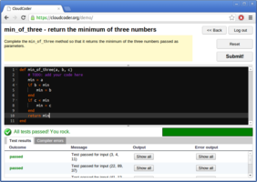

CloudCoder is an [open source](opensource.html) web-based programming exercise system
(inspired heavily by [CodingBat](http://codingbat.com/)).
It is designed to make it easy for instructors of introductory
programming courses to assign short exercises to students for
skills development and assessment.  Currently, exercises in
C/C++, Java, Python, and Ruby are supported.

Because CloudCoder is web-based, it is easy for students to
use.  The only software students need to work on exercises
is a web browser.

The screenshot on the right shows a Ruby exercise (click for larger image).
The [Screenshots](https://github.com/cloudcoderdotorg/CloudCoder/wiki/Screenshots)
page shows CloudCoder in action.

The [CloudCoder exercise repository](https://cloudcoder.org/repo)
is a database of freely-redistributable exercises written by
CloudCoder users.  You can easily import problems from the repository
into your own CloudCoder installation for your students to
use.  You can also publish the exercises you write to the repository.

To run CloudCoder, you need two Linux servers: one to host the
web application and database, and one to compile and test student
submissions.  Only the web/database server needs to be
network-facing.  See the [Install](https://github.com/cloudcoderdotorg/CloudCoder/wiki/Install)
page for details.

If you are an instructor interested in adopting CloudCoder,
you can request an account on our [demo server](demo.html).

The [CloudCoder wiki](https://github.com/cloudcoderdotorg/CloudCoder/wiki)
is where the CloudCoder documentation lives.
